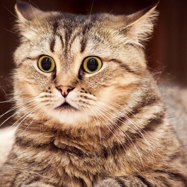
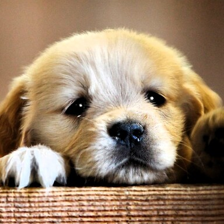
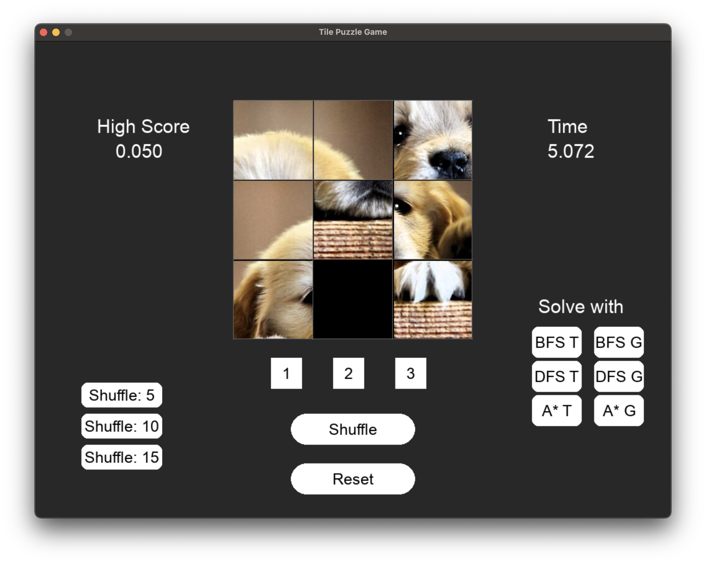
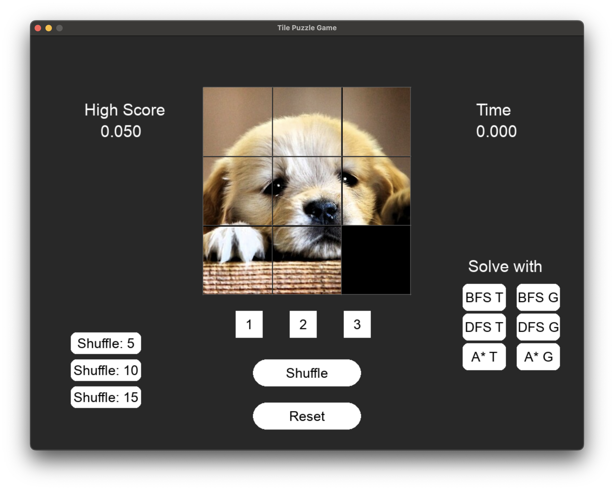

# Eight Puzzle Solver

This project implements the classic Eight Puzzle game, where the goal is to arrange tiles in order by sliding them into the empty space. It is designed as part of an AI coursework assignment.

## Features
- Interactive puzzle game
- Multiple image tile sets (cat, cub, dog)
- Shuffle and solve functionality

## How to Run
1. Make sure you have Python 3 installed.
2. Run the main script:
   ```bash
   python main.py
   ```

## State Space
The state is represented as a 3x3 matrix (list of lists), where each entry is a tile number (1-8) or 0 for the empty space. Example:
```
[[1, 2, 3],
 [4, 5, 6],
 [7, 8, 0]]
```

## Action Space
The empty tile can move in four directions, if the move is within bounds:
- "UP"
- "DOWN"
- "LEFT"
- "RIGHT"

## Parameters
- `GAMESIZE`: Size of the puzzle (default 3 for 8-puzzle)
- `SHUFFLE`: Number of shuffle moves
- Image selection: Choose between different tile images (dog, cat, cub)

## Images
Below are the sample images used in the puzzle:


<br/>

<br/>

<br/>

<br/>


## Folder Structure
- `main.py`: Entry point for the game
- `src/`: Source code for game logic
- `agent/`: AI agents for solving the puzzle
- `images/`: Image assets for the puzzle
- `score/`: Score tracking
- 
